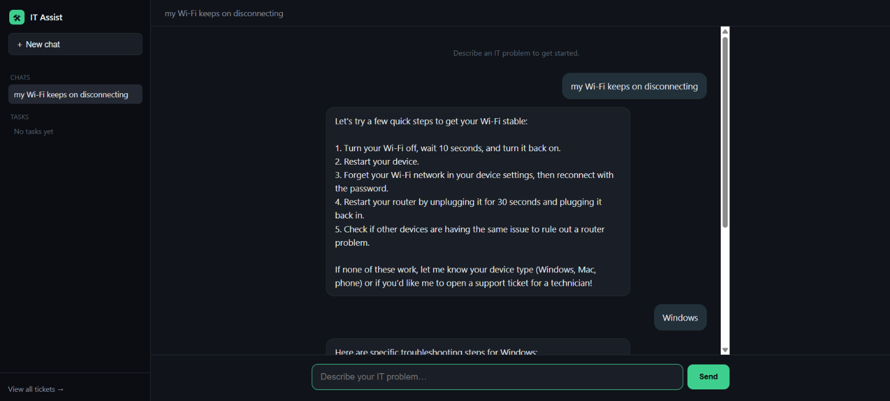
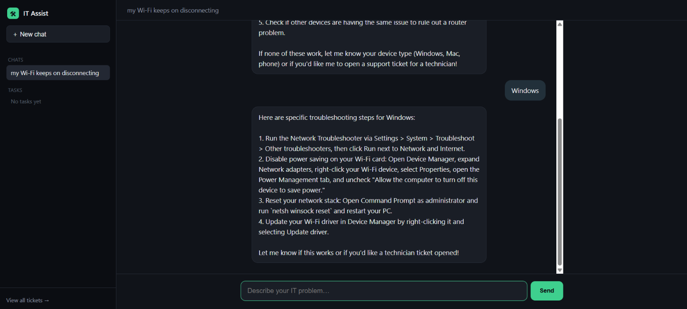
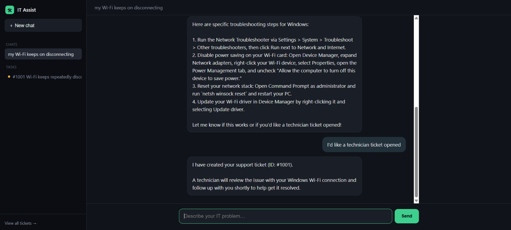
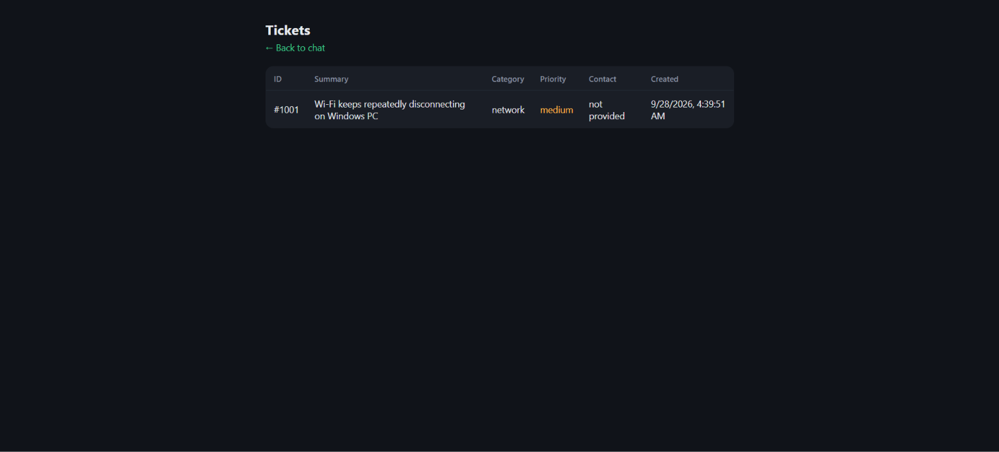

# IT Assist
An AI-powered IT support assistant that diagnoses technical issues, guides users through troubleshooting, and automatically creates support tickets when problems remain unresolved.

Instead of requiring support staff to read every request, identify the issue, and manually create a ticket, the assistant turns the process into a self-service workflow. It asks only the necessary clarifying questions, provides step-by-step troubleshooting, and, when the user confirms the issue is still unresolved, automatically calls a create_ticket function to log the problem with the appropriate category, priority, and contact details.


## Technologies Used

| Tool | Purpose |
|---|---|
| Node.js + Express | Backend server and API routes |
| Google Gemini API (`gemini-3.8-flash`) | AI diagnosis, conversation, and function calling |
| Gemini function calling | Structured `create_ticket` calls instead of free-text parsing |
| JSON file storage | Persists chat sessions (`data/chats.json`) and tickets (`data/tickets.json`) |
| Vanilla HTML/CSS/JS | Frontend chat UI and admin ticket view, no framework |
| dotenv | Keeps the API key server-side, out of the browser and out of git |

## Features
- **AI-powered diagnosis** — every message is read in context; the assistant asks at most one clarifying question, then gives a short numbered list of troubleshooting steps.
- **Automatic ticket creation** — when the user says a fix didn't work (or asks for a human), the model itself calls `create_ticket` with a summary, category, priority, and contact info — the ticket is a side effect of the conversation, not a separate form.
- **Multi-chat history** — a sidebar lists past conversations by auto-generated title; clicking one reloads its full history and continues where it left off.
- **Task/ticket history** — every ticket created shows up in a sidebar list with a priority indicator, and in full detail on a dedicated admin page.
- **Zero ongoing cost** — runs entirely on Gemini's free API tier, no credit card required.

## See It in Action

Here's an example of the assistant handling a common IT support issue:

> **"My Wi-Fi keeps disconnecting."**

The assistant identifies the problem, asks only for the information it needs, and guides the user through troubleshooting before escalating the issue to a support ticket if the problem remains unresolved.




If the troubleshooting steps do not resolve the issue, the assistant automatically calls `create_ticket`, generates a support ticket, and confirms the ticket number directly in the chat.



All created tickets are also stored in the application and can be viewed through the **"View All Tickets"** page, accessible from the lower-left section of the interface. This provides administrators with a centralized view of ticket details, priorities, and support history.



## The Process — How I Built It
- **Mapped the flow first.** Before writing code, I defined the conversation in plain English: describe issue → clarify if needed → troubleshooting steps → if unresolved, collect ticket details → create ticket → confirm. That became the system prompt.
- **Picked a stack that keeps the API key safe.** The Gemini key can never live in browser code, so a small Express backend proxies every request — the frontend only ever talks to my own server.
- **Built the function-calling loop.** Gemini can respond with plain text or a `functionCall` block. The server loops: call Gemini, check for a function call, execute it (write the ticket, return a result), call Gemini again — until it stops calling functions and gives a final answer.
- **Started with a single chat, then upgraded to sessions.** The first version held one conversation in memory. I rebuilt it around persisted chat sessions (`GET/POST /api/chats`, `POST /api/chats/:id/message`) so multiple conversations can be started, listed, and revisited — closer to how a real support tool would work.
- **Redesigned the UI around a sidebar app shell** once the backend supported multiple sessions — a left panel for chat history and ticket ("task") history, with the active conversation on the right, instead of a single flat chat box.
- **Adapted when the model was deprecated.** Google retired the model I started with for new API keys mid-build; the fix was reading the API's own error message, which named the replacement model directly.

## What I Learned
- How AI function/tool calling actually works end to end — not just "the model can use tools," but the exact request/response shape (`functionCall` → execute → `functionResponse` → call again) and how that differs between providers.
- Why the API key has to stay server-side, and how that one constraint shapes the whole architecture (you can't skip the backend, even for a "simple" AI chat).
- Debugging real deployment friction on Windows: PowerShell's script execution policy blocking `npm`, and hidden file extensions making `.env` and `server.js` hard to find in File Explorer.
- That API models get deprecated without warning, and the fastest fix is usually in the error message itself, not a Google search.
- The difference between conversation state (what keeps a chat coherent) and ticket state (what a support team actually needs) — and why mixing them causes bugs.

## How It Could Be Improved
- **Real ticketing system integration** — replace the JSON file with a call to Zendesk, Freshdesk, or Jira Service Management.
- **A persistent database** — SQLite or Postgres instead of a JSON file, so data survives a redeploy on hosts with an ephemeral filesystem.
- **Admin authentication** — the ticket view is currently unprotected; add a login before putting real user data behind it.
- **Streaming responses** — show the AI's reply as it's generated instead of waiting for the full answer.
- **Escalation timers** — auto-flag tickets that haven't been picked up within a set time.

## How to Run This Project
1. **Clone or download this repo**, then open a terminal in the project folder.
2. **Install dependencies:**
   ```
   npm install
   ```
3. **Get a free Gemini API key** at https://aistudio.google.com/app/apikey — sign in with Google, click "Create API key." No billing setup required.
4. **Set up your environment file:**
   ```
   cp .env.example .env
   ```
   Open `.env` and replace the placeholder with your real key:
   ```
   GEMINI_API_KEY=your_actual_key_here
   ```
5. **Start the server:**
   ```
   npm start
   ```
6. **Open it in your browser:** go to `http://localhost:3000` for the assistant, and `http://localhost:3000/admin.html` to view all tickets created.

## License
This project is open for learning and reference purposes.
